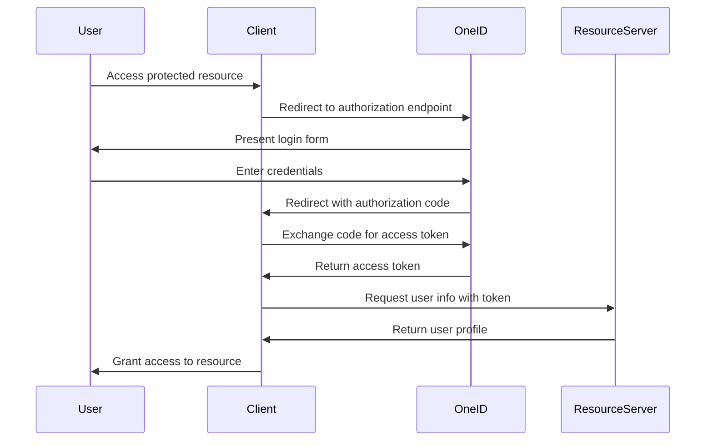

# OneID System Documentation

## Overview

OneID (Yagona identifikatsiya tizimi) is Uzbekistan's unified identification system that provides secure authentication and user identification services for government and non-government organizations.

## System Architecture

OneID operates as an OAuth 2.0 authorization server with the following key components:

- **Authorization Server**: Handles user authentication and authorization
- **Resource Server**: Provides user profile information
- **Client Applications**: Applications that integrate with OneID

## Authentication Flow

### 1. Authorization Code Flow

The OneID system uses the standard OAuth 2.0 authorization code flow:



### 2. Authorization URL Parameters

When redirecting users to OneID, the following parameters are required:

| Parameter | Description | Required |
|-----------|-------------|----------|
| `response_type` | Must be `code` | Yes |
| `client_id` | Your application's client ID | Yes |
| `redirect_uri` | Callback URL for your application | Yes |
| `scope` | Requested permissions | Yes |
| `state` | CSRF protection token | Recommended |

Example authorization URL:
```
https://sso.egov.uz/sso/oauth/Authorization.do?response_type=code&client_id=YOUR_CLIENT_ID&redirect_uri=https://your-app.com/callback&scope=openid+profile&state=csrf_token
```

### 3. Token Exchange

After receiving the authorization code, exchange it for an access token:

**Endpoint**: `POST /sso/oauth/Authorization.do`

**Parameters**:
```json
{
  "grant_type": "one_authorization_code",
  "client_id": "YOUR_CLIENT_ID",
  "client_secret": "YOUR_CLIENT_SECRET",
  "redirect_uri": "https://your-app.com/callback",
  "code": "AUTHORIZATION_CODE"
}
```

**Response**:
```json
{
  "access_token": "ACCESS_TOKEN",
  "token_type": "Bearer",
  "expires_in": 3600
}
```

### 4. User Information Retrieval

Use the access token to retrieve user information:

**Endpoint**: `POST /sso/oauth/Authorization.do`

**Parameters**:
```json
{
  "grant_type": "one_access_token_identify",
  "client_id": "YOUR_CLIENT_ID",
  "client_secret": "YOUR_CLIENT_SECRET",
  "scope": "openid profile",
  "redirect_uri": "https://your-app.com/callback",
  "access_token": "ACCESS_TOKEN"
}
```

**Response**:
```json
{
  "pin": "12345678901234",
  "first_name": "John",
  "last_name": "Doe",
  "middle_name": "Smith",
  "birth_date": "1990-01-01",
  "gender": "male",
  "nationality": "UZ",
  "region": "Tashkent",
  "district": "Yunusabad"
}
```

### 5. Logout

To logout a user from OneID:

**Endpoint**: `POST /sso/oauth/Authorization.do`

**Parameters**:
```json
{
  "grant_type": "one_log_out",
  "client_id": "YOUR_CLIENT_ID",
  "client_secret": "YOUR_CLIENT_SECRET",
  "scope": "openid profile",
  "access_token": "ACCESS_TOKEN"
}
```

## User Data Fields

### Required Fields

| Field | Description | Format |
|-------|-------------|---------|
| `pin` | Personal Identification Number | 14 digits |
| `first_name` | First name | String |
| `last_name` | Last name | String |
| `middle_name` | Middle name | String |

### Optional Fields

| Field | Description | Format |
|-------|-------------|---------|
| `birth_date` | Date of birth | YYYY-MM-DD |
| `gender` | Gender | male/female |
| `nationality` | Nationality code | 2-letter ISO code |
| `region` | Region name | String |
| `district` | District name | String |

## Security Considerations

### 1. HTTPS Required

All communication with OneID must use HTTPS. Never send credentials over unencrypted connections.

### 2. State Parameter

Always use the `state` parameter to prevent CSRF attacks:

```php
$state = csrf_token();
$authUrl = OneID::getAuthorizationUrl();
```

### 3. Token Storage

Store access tokens securely and never expose them in logs or client-side code.

### 4. Token Validation

Always validate tokens before trusting user data:

```php
$isValid = OneID::validateToken($accessToken);
if (!$isValid) {
    // Handle invalid token
}
```

### 5. Rate Limiting

OneID implements rate limiting. Implement appropriate retry logic in your application.

## Error Handling

### Common Error Codes

| Error | Description | Solution |
|-------|-------------|----------|
| `invalid_client` | Invalid client credentials | Check client_id and client_secret |
| `invalid_grant` | Invalid authorization code | Code may be expired or already used |
| `invalid_request` | Malformed request | Check required parameters |
| `unauthorized_client` | Client not authorized | Contact OneID support |
| `unsupported_grant_type` | Unsupported grant type | Use correct grant_type |

### Error Response Format

```json
{
  "error": "error_code",
  "error_description": "Human readable description"
}
```

## Testing

### Sandbox Environment

OneID provides a sandbox environment for testing:
- Base URL: `https://test-sso.egov.uz`
- Use test credentials provided by OneID

### Test Data

Use the following test credentials for development:
- PIN: `12345678901234`
- Name: Test User

## Best Practices

### 1. Configuration Management

Store OneID credentials securely:
- Use environment variables
- Never commit credentials to version control
- Use different credentials for different environments

### 2. Error Handling

Implement comprehensive error handling:
```php
try {
    $result = OneID::handle($code);
    if ($result->success) {
        // Handle success
    } else {
        // Handle authentication failure
        Log::error('OneID authentication failed', $result->toArray());
    }
} catch (Exception $e) {
    // Handle unexpected errors
    Log::error('OneID error', ['error' => $e->getMessage()]);
}
```

### 3. Logging

Log all OneID interactions for debugging and monitoring:
```php
// Enable OneID logging
ONEID_LOGGING_ENABLED=true
ONEID_LOG_LEVEL=info
```

### 4. Caching

Consider caching user data to reduce API calls:
```php
// Enable OneID caching
ONEID_CACHE_ENABLED=true
ONEID_CACHE_TTL=3600
```

### 5. User Experience

Provide clear feedback to users:
- Show loading states during authentication
- Display helpful error messages
- Provide fallback authentication methods

## Troubleshooting

### Common Issues

1. **"Invalid redirect URI"**
   - Ensure redirect URI matches exactly what's configured in OneID
   - Check for trailing slashes and HTTP vs HTTPS

2. **"Invalid client"**
   - Verify client_id and client_secret are correct
   - Check if application is approved in OneID

3. **"Code expired"**
   - Authorization codes expire quickly
   - Implement immediate token exchange

4. **"Network timeout"**
   - OneID servers may be slow
   - Implement retry logic with exponential backoff

### Debug Mode

Enable debug logging to troubleshoot issues:
```env
ONEID_LOGGING_ENABLED=true
ONEID_LOG_LEVEL=debug
LOG_CHANNEL=stack
```

## Support

For technical support:
- OneID Documentation: [Official OneID Portal](https://sso.egov.uz)
- Package Issues: [GitHub Issues](https://github.com/aslnbxrz/oneid/issues)
- Email: [bexruz.aslonov1@gmail.com](mailto:bexruz.aslonov1@gmail.com)

## Changelog

### Version 2.0.0
- Complete rewrite with professional architecture
- Enhanced error handling and logging
- Improved security features
- Better documentation

### Version 1.0.0
- Initial release
- Basic OneID integration
